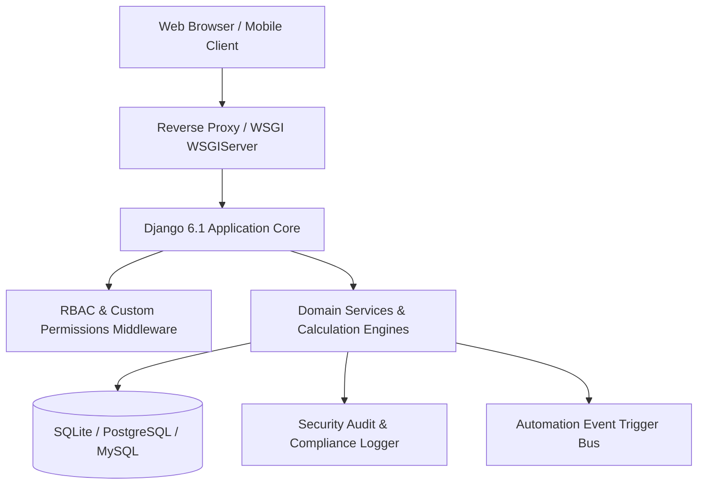

# Smart Employee Management System (Smart EMS) — Architecture Specification

## 1. Executive System Overview
Bharat Enterprise Solutions Smart EMS is a production-grade, multi-tier Human Resource Management (HRMS), Enterprise Workforce, Payroll, Compliance, and Operations platform designed to support scalable enterprise organizations with role-based access control (RBAC), multi-subsidiary organizational trees, and automated workflows.

## 2. Structural Module Taxonomy (34 Enterprise Modules)
1. **Core & Security**: Authentication, Employees (360° Profile), Organization (Departments/Teams), Permissions (Custom RBAC Matrix)
2. **Time & Workforce**: Attendance (Biometric/Geofencing), Leave Management, Shifts & Holidays, Workload Balancing
3. **Work & Productivity**: Project Management, Task Management & Kanban, Skills Matrix, Goals & OKRs
4. **Employee Development**: Performance Reviews, Training & LMS, Recognition & Kudos
5. **Employee Services**: Asset Management, Expense Claims, Helpdesk Support, Document Center, Announcements, Notifications
6. **Intelligence & Admin**: Smart Insights (Predictive ML), Reports & Exports, System Administration & Audit Logs
7. **Compensation & Talent**: Payroll & Tax Engine, Recruitment & ATS, Employee Lifecycle & Exit Clearances, Corporate Benefits & Insurance
8. **Workplace & Governance**: Client Timesheets & Billing, Surveys & eNPS, Statutory Compliance (Labor Law / POSH), Smart Workplace (Desks/Travel), Developer REST API, Automation Engine.

## 3. Security, Encryption & Integrity
- **Role-Based Access Control**: 4 Primary System Roles (Administrator, HR Manager, Team Manager, Staff Member) with granular permissions.
- **CSRF & Session Protection**: CSRF middleware enforcement on all state-mutating requests, HttpOnly session cookies.
- **Data Protection**: Sensitive PAN, UAN, and banking details masked and audit-logged on access.
