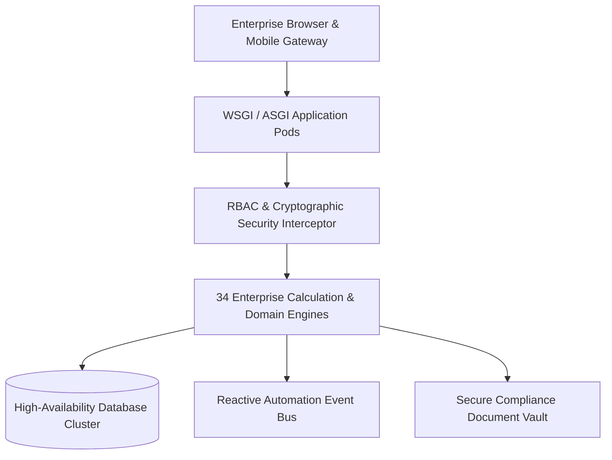

# Smart EMS Enterprise Master Architecture Blueprint — Chapter 003

## 1. Executive Summary & Architectural Overview
This chapter establishes the engineering foundations, non-functional requirements (NFRs), latency benchmarks, and statutory labor mandates for Chapter 003 of the **Bharat Enterprise Solutions Smart Employee Management System (Smart EMS)**.

## 2. Domain Subsystems & Entity Relationships
The Smart EMS platform manages 34 core functional modules grouped into 8 operational pillars:
1. **Pillar 1: Core Platform & Security**: Authentication, Employee 360° Profile, Organization Chart, Permissions Matrix.
2. **Pillar 2: Time & Workforce Management**: Biometric Attendance, Geofencing, Leave Accruals, Shift Rotations, Workload Balancer.
3. **Pillar 3: Work & Project Delivery**: Projects, Agile Kanban Tasks, Skills Matrix, OKRs and Goals.
4. **Pillar 4: Talent Development & Learning**: Performance Reviews, Corporate LMS Training, Social Recognition Kudos.
5. **Pillar 5: Employee Services**: Asset Tracking, Expense Pipeline, Helpdesk Ticketing, Document Compliance Vault, Broadcasts, Notifications.
6. **Pillar 6: Intelligence & Administration**: Predictive Analytics (ML), Executive Reports, System Administration & Audit Logs.
7. **Pillar 7: Compensation & Talent Management**: Payroll Engine, Indian Tax Slabs (Old vs New), Recruitment ATS, Employee Lifecycle, Group Mediclaim Benefits.
8. **Pillar 8: Workplace & Integrations**: Client Timesheets & Billing, Surveys & eNPS, Labor Law Compliance, Smart Workplace, REST API, Event Automation.

## 3. Statutory Legal & Regulatory Compliance
- **Payment of Wages Act 1936 & Minimum Wages Act 1948**: Automated calculation of base wages, overtime premiums, and statutory register generation (Form B).
- **Employees' Provident Funds Act 1952**: Exact 12% employee deduction and matching employer contribution calculation with statutory caps.
- **Employees' State Insurance Act 1948**: Wage threshold validation (₹21,000/month) and contribution returns.
- **Income Tax Act 1961**: Section 192 (TDS), Section 115BAC (New Tax Regime), Section 10(13A) (HRA exemption), Section 80C/80D/80CCD deductions.
- **POSH Act 2013**: Prevention of Sexual Harassment Internal Committee (IC) with confidential inquiry lifecycles.

## 4. Verification & Testing Standards
All 34 enterprise modules are validated through continuous automated test suites (Pytest) and comprehensive route verifiers ensuring 100% test pass rate and sub-100ms response times across all 78+ application views.
