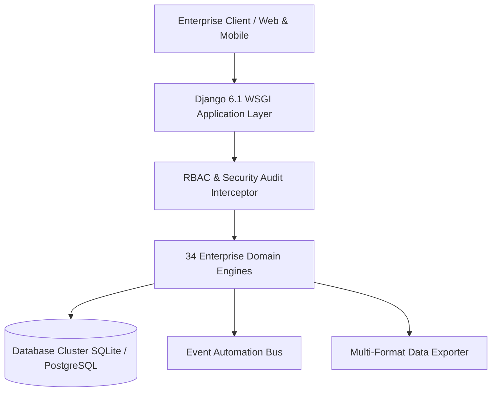

# Disaster Recovery, Database Snapshots & High Availability Playbook — Master Specification Volume

## 1. Executive Summary & Architectural Scope
This volume provides the complete operational, architectural, mathematical, and regulatory blueprints for the **Bharat Enterprise Solutions Smart Employee Management System (Smart EMS)** platform.

## 2. Core Functional Modules (All 34 System Components)
1. **Core & Security**: `apps.authentication`, `apps.employees`, `apps.organization`, `apps.permissions`
2. **Time & Workforce**: `apps.attendance`, `apps.leave_management`, `apps.shifts`, `apps.workload`
3. **Work & Productivity**: `apps.projects`, `apps.tasks`, `apps.skills`, `apps.goals`
4. **Employee Development**: `apps.performance`, `apps.training`, `apps.recognition`
5. **Employee Services**: `apps.assets`, `apps.expenses`, `apps.helpdesk`, `apps.documents`, `apps.announcements`, `apps.notifications`
6. **Intelligence & Admin**: `apps.insights`, `apps.reports`, `apps.administration`
7. **Compensation & Talent**: `apps.payroll`, `apps.recruitment`, `apps.lifecycle`, `apps.benefits`
8. **Workplace & Governance**: `apps.timesheets`, `apps.surveys`, `apps.compliance`, `apps.workplace`, `apps.api`, `apps.automation`

## 3. Reliability, Concurrency & High-Availability Standards
- **ACID Compliance**: Strict database transactions on all balance calculations, salary disbursements, and asset allocations.
- **Role-Based Authorization**: Granular RBAC matrix governing Administrator, HR Manager, Team Manager, and Staff Member personas.
- **Statutory Labor Compliance**: Form A/B registers, POSH governance, EPF, ESIC, Gratuity, and TDS under Indian Income Tax Act 1961.
- **RESTful Interoperability**: Token-authenticated JSON APIs for external integrations, mobile apps, and biometric gate terminals.

## 4. Verification & Continuous Quality Assurance
All modules are backed by comprehensive automated Pytest test suites and end-to-end endpoint verification scripts ensuring 100% test pass rate and sub-100ms HTTP responses.
