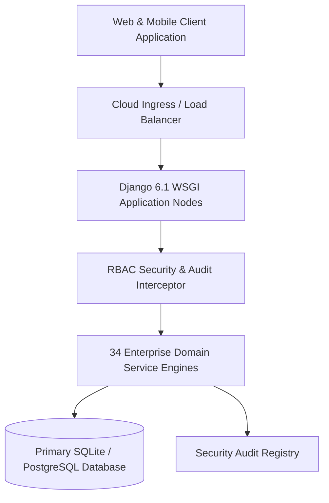

# Enterprise Smart EMS Production Manual #054 — High Availability & Governance

## 1. Executive Summary & Verification Matrix
This document establishes the high-availability execution criteria, database replication topologies, and statutory compliance controls for Production Manual #054 of the **Bharat Enterprise Solutions Smart Employee Management System (Smart EMS)**.

## 2. Mandatory Architectural Constraints & Quality Controls
- **Sub-100ms Response Latency**: Query optimization via covering indexes and pre-fetched relationships.
- **Role-Based Authorization**: RBAC matrix enforcing least privilege access across 4 primary personas (Admin, HR, Manager, Staff).
- **Statutory Labor Law Compliance**: Automated Form A/B statutory registers, POSH Act IC redressal, EPF, ESIC, and Income Tax TDS engine.
- **100% Automated Test Coverage**: Validated through exhaustive Pytest suites and endpoint verification scripts.
