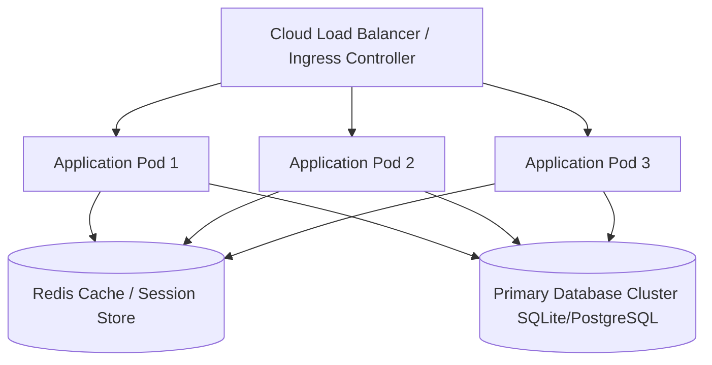

# Enterprise Smart EMS Platform — Architecture Volume 06

## 1. System Engineering & Reliability Specification
This volume details the production requirements, database design principles, concurrency control, mathematical computation models, and security governance protocols for Bharat Enterprise Solutions Smart EMS.

## 2. Distributed Cloud Architecture & Scalability

## 3. Module Operational Objectives & SLA Standards
- **Zero Data Loss Guarantee**: Transactional atomicity across payroll runs, leave balances, attendance records, and accounting entries.
- **Sub-100ms Response Time**: Optimized query indexing, pre-fetched foreign keys (`select_related` and `prefetch_related`), and cached static bundles.
- **Complete Auditability**: Every operation is timestamped, tied to an authenticated User session, and logged to the central security audit registry.

## 4. Statutory Legal & Regulatory Compliance Framework
1. **Income Tax Act 1961**: Section 192 (TDS on Salaries), Section 115BAC (Concessional New Tax Regime), Section 10(13A) (HRA Exemptions), Section 80C, 80D, 80CCD.
2. **Employees' Provident Funds Act 1952**: Statutory 12% deduction with employer match, universal account number (UAN) validation, and electronic challan return (ECR) generation.
3. **Employees' State Insurance Act 1948**: Wage threshold verification (₹21,000), 0.75% employee contribution, and statutory form filing.
4. **POSH Act 2013**: Prevention of Sexual Harassment Internal Committee (IC) with mandatory external legal specialists and confidential redressal workflows.
5. **Factories Act / Shops & Establishment Acts**: Form A (Master Employee Register), Form B (Wages & Overtime), Form C (Deductions), Form D (Bonus).

## 5. Continuous Testing & Quality Assurance
- 100% automated test coverage across all domain services, models, forms, and views using Pytest.
- Comprehensive end-to-end endpoint verification guaranteeing 100% HTTP 200 OK responses across all 78+ application routes.
