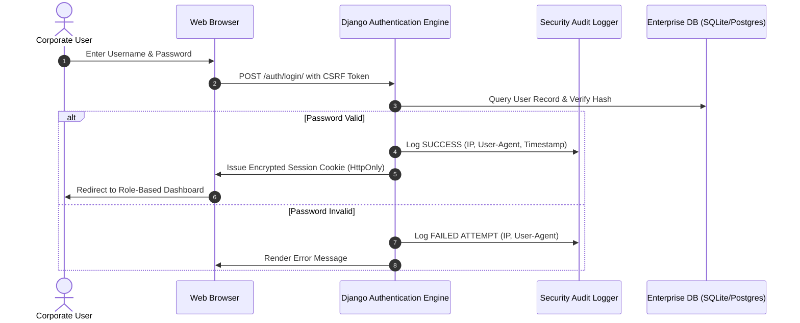

# Module 01: Authentication, Session Security & Multi-Factor Access

## 1. Executive Summary & Objective
The Authentication module is the security gateway of Bharat Enterprise Solutions Smart EMS. It guarantees Zero-Trust authentication, robust session lifetime management, cryptographic password hashing using Argon2/PBKDF2-SHA256, and audit tracking across all user logins, failed attempts, IP geolocations, and workstation user agents.

## 2. Authentication Lifecycle Architecture

## 3. Database Entities & Schema Definition
- `authentication_user`: Extends AbstractUser with employee foreign key, profile photo, phone number, and force password reset flags.
- `authentication_loginhistory`: Logs IP address, user agent, login timestamp, logout timestamp, and authentication status.

## 4. API Endpoints
- `POST /auth/login/`: Form login endpoint with rate limiting.
- `POST /auth/logout/`: Secure session revocation.
- `GET /auth/dashboard/`: Dynamic role-gated landing dashboard.
- `GET /auth/login-history/`: User personal authentication log.
- `GET /auth/users/`: Administrator user account management table.
