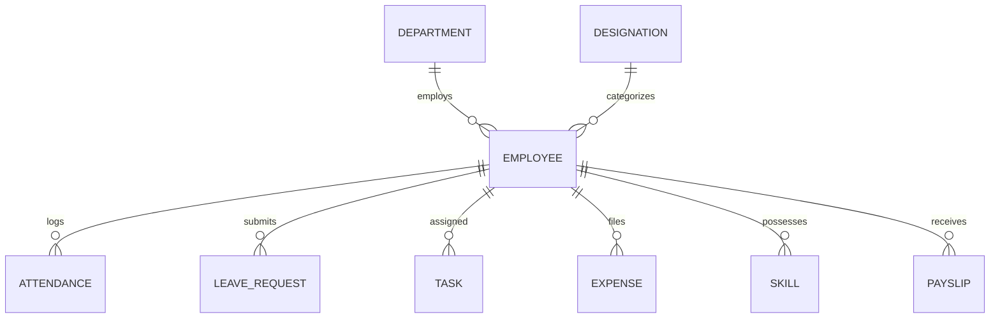

# Module 02: Employee 360° Profile & Master Directory

## 1. Overview
The Employee module serves as the single source of truth for workforce identity, biographical data, organizational positioning, skills portfolio, historical compensation, direct reporting relationships, emergency contacts, and statutory documentation.

## 2. Data Hierarchy

## 3. Key Capabilities
- **Employee 360° Hub**: Consolidated view bringing together attendance percentage, open tasks, leave balances, performance scores, salary slips, and assigned hardware.
- **Hierarchical Org Tree**: Visual direct reporting tree from Executive Leadership down to individual squad members.
- **Search & Filters**: Multi-criteria search by department, skill, designation, employment status, or blood group.
- **Data Exporting**: Instant CSV, Excel, and printable PDF exports of employee directory records.
