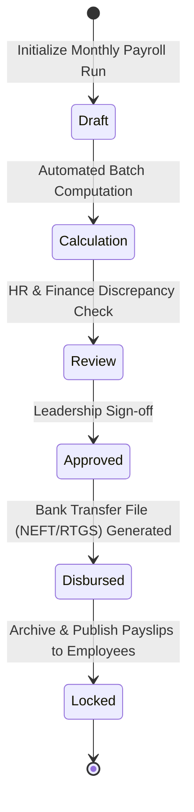

# Module 25: Enterprise Payroll, Statutory Taxes & Compensation Engine

## 1. Scope & Compliance Overview
The Payroll Engine implements automated salary processing adhering strictly to the Indian Income Tax Act 1961, Employees' Provident Funds and Miscellaneous Provisions Act 1952, Employees' State Insurance Act 1948, and Payment of Gratuity Act 1972.

## 2. Payroll Execution State Machine

## 3. Tax Slabs Comparison Matrix
| Income Slab (INR) | New Tax Regime (Sec 115BAC) | Old Tax Regime |
| :--- | :--- | :--- |
| **0 - 3,00,000** | 0% | 0% |
| **3,00,001 - 7,00,000** | 5% (Rebate up to 7L) | 5% (Rebate up to 5L) |
| **7,00,001 - 10,00,000** | 10% | 20% |
| **10,00,001 - 12,00,000** | 15% | 20% |
| **12,00,001 - 15,00,000** | 20% | 30% |
| **Above 15,00,000** | 30% | 30% |
| **Standard Deduction** | ₹75,000 | ₹50,000 |
| **80C / 80D Deductions** | Not Allowed | Allowed up to ₹2,00,000+ |
