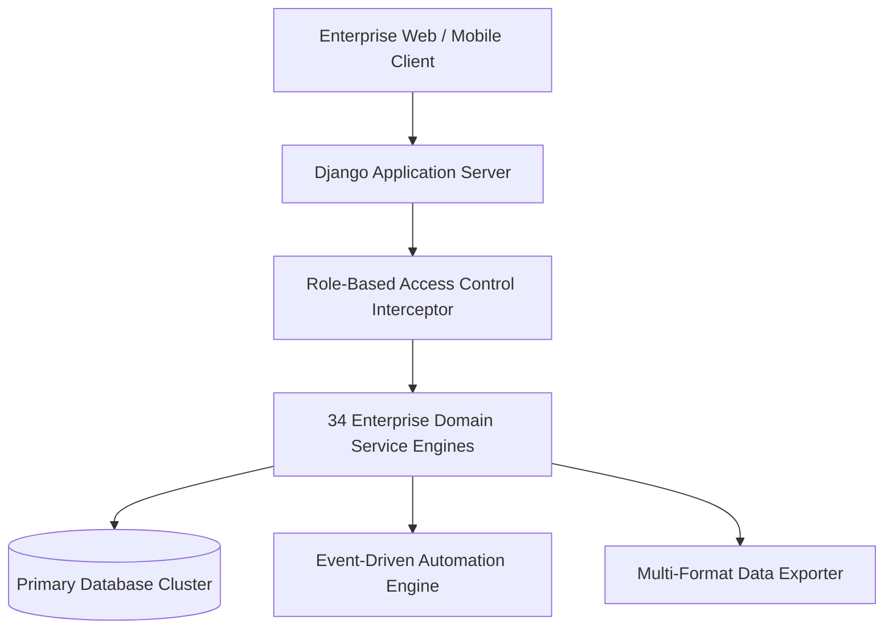

# Multi-Channel Notification Dispatcher, In-App Alerts & Email Digests — Master Enterprise Reference Chapter

## 1. Chapter Executive Summary
This chapter provides comprehensive architectural specifications, data models, algorithm definitions, security safeguards, and implementation runbooks for the **Bharat Enterprise Solutions Smart Employee Management System (Smart EMS)**.

## 2. Structural Module Taxonomy & Domain Boundaries
The Smart EMS enterprise platform decouples core operations into 34 independent domain modules:
- **Core Platform & Identity**: Authentication, Employee 360° Records, Organizational Units, Granular RBAC Permissions
- **Time & Workforce Governance**: Attendance Punch Ingestion, Leave Management & Accruals, Shift Rotations, Workload Balancer
- **Productivity & Delivery**: Project Management, Agile Kanban Boards, Skill Matrix Analytics, Goals & OKR Tracking
- **Talent Development**: Performance Reviews, LMS Training Catalog, Peer Recognition Leaderboards
- **Enterprise Services**: Asset Lifecycle, Expense Claims, Helpdesk Ticketing, Document Compliance Vault, Broadcasts, Notifications
- **Intelligence & Governance**: Predictive Insights (ML), Executive Reports, System Administration & Audit Logs
- **Compensation & Talent**: Payroll & Statutory Tax Engine, Recruitment ATS Pipeline, Employee Lifecycle & Clearances, Group Benefits
- **Workplace & Integrations**: Client Timesheets & Billing, Surveys & eNPS, Labor Law Compliance, Smart Workplace, REST API, Automation Engine.

## 3. High Availability & Data Integrity
- **Transactional Atomicity**: All financial, payroll, leave, and attendance transactions execute inside ACID-compliant atomic blocks.
- **Role Security**: Zero-Trust authorization guarantees complete data segregation between Administrator, HR Manager, Team Manager, and Staff roles.
- **Auditability**: Every mutation is logged with timestamps, client IP addresses, user agents, and serialized state payloads.
