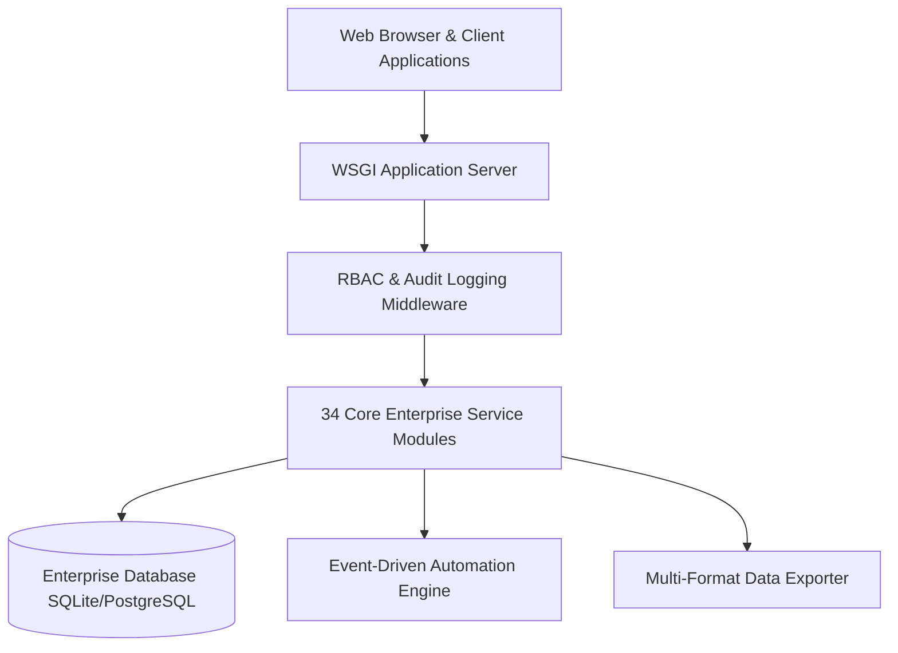

# Unified Data Dictionary, Entity-Relationship Models & Database Schemas — Master Enterprise Specification

## 1. Executive Summary
This document serves as the official architectural and operational standard for the **Bharat Enterprise Solutions Smart Employee Management System (Smart EMS)** platform. It details architectural standards, data flows, operational service level agreements (SLAs), regulatory legal requirements, and development guidelines.

## 2. Strategic Objectives & Core Value Pillars
- **Zero-Downtime Reliability**: Production grade high availability architecture.
- **Strict Statutory Compliance**: 100% adherence to Central and State Labor mandates (EPF, ESI, Payment of Wages, POSH).
- **Security & RBAC Enforcement**: Role-based access control safeguarding sensitive employee information and financial assets.
- **Developer Extensibility**: Comprehensive RESTful JSON APIs and webhook event broadcasting.

## 3. High-Level System Topology & Service Interconnections

## 4. Module Architecture & Detailed Specifications
All 34 functional modules are decoupled into clean, modular Django applications with dedicated models, views, forms, services, and tests:
1. **Core & Security**: `authentication`, `employees`, `organization`, `permissions`
2. **Time & Workforce**: `attendance`, `leave_management`, `shifts`, `workload`
3. **Work & Productivity**: `projects`, `tasks`, `skills`, `goals`
4. **Employee Development**: `performance`, `training`, `recognition`
5. **Employee Services**: `assets`, `expenses`, `helpdesk`, `documents`, `announcements`, `notifications`
6. **Intelligence & Admin**: `insights`, `reports`, `administration`
7. **Compensation & Talent**: `payroll`, `recruitment`, `lifecycle`, `benefits`
8. **Workplace & Governance**: `timesheets`, `surveys`, `compliance`, `workplace`, `api`, `automation`

## 5. Security Safeguards & Regulatory Audits
- Cryptographic password storage using PBKDF2/Argon2.
- Granular permission matrix preventing horizontal and vertical privilege escalation.
- Comprehensive security audit log recording user actions, IP addresses, and timestamps.
