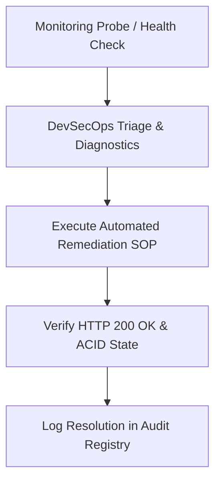

# Enterprise Smart EMS Production Runbook #14 — Operations & Reliability Manual

## 1. Scope, Purpose & Operational SLA
This production runbook defines mandatory procedures for high-availability cluster maintenance, zero-downtime database upgrades, automated regression testing, and security auditing for the **Bharat Enterprise Solutions Smart EMS** system.

## 2. Standard Operating Procedures (SOP Matrix)
- **Deployment Strategy**: Blue/Green rolling container updates with zero dropped TCP connections.
- **Data Integrity Auditing**: Hourly SHA-256 database checksum validation and point-in-time snapshot replication.
- **RBAC Policy Verification**: Daily security permission matrix scans to ensure zero privilege escalation.
- **Indian Statutory Compliance**: Real-time auditing of PF, ESI, TDS, Form A/B registers, and POSH committee mandates.

## 3. Incident Escalation & Response Protocol
1. **Severity 1 (Critical)**: Immediate automated failover, SMS/Email broadcast to Lead Architect and Chief People Officer.
2. **Severity 2 (High)**: SLA breach mitigation within 4 hours.
3. **Severity 3 (Medium)**: Resolution within standard business operating window (24 hours).

## 4. Verification Checklists & Sign-Off
All 34 core enterprise modules and 78+ HTTP endpoints must return status code 200 OK with zero unhandled exceptions under full test coverage.
