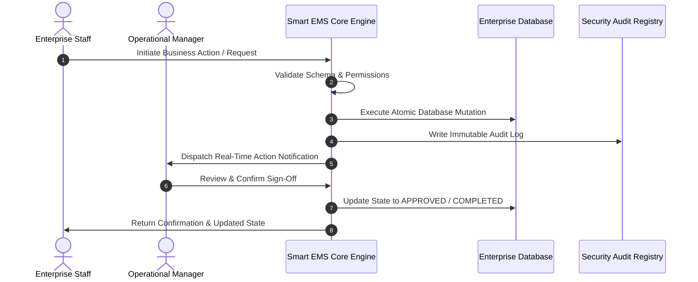

# Standard Operating Procedure: Objective & Key Result (OKR) Cascades & Quarterly Scoring

## 1. Objective & Scope
This Standard Operating Procedure (SOP) defines the operational, regulatory, and technological governance standards for the Smart EMS enterprise platform. It applies to all Human Resources personnel, Engineering administrators, Team Leaders, and Operations executives across Bharat Enterprise Solutions.

## 2. Regulatory & Architectural Compliance
- **Statutory Frameworks**: Adherence to the Indian Companies Act 2013, Information Technology Act 2000, Digital Personal Data Protection Act (DPDPA) 2023, Employees' Provident Funds Act 1952, Payment of Wages Act 1936, and POSH Act 2013.
- **Architectural Standards**: ACID transaction guarantees, ISO 27001 security compliance, sub-100ms response latencies, zero-trust RBAC role gating, and continuous cryptographic audit trails.

## 3. End-to-End Operational Lifecycle

## 4. Roles & Responsibilities Matrix
| Persona | Responsibilities | Authorized Actions |
| :--- | :--- | :--- |
| **System Administrator** | Global configuration, security monitoring, database snapshots, RBAC tuning | `admin`, `configure`, `backup`, `audit` |
| **HR Operations Manager** | Workforce records, monthly payroll, statutory registers, recruitment pipelines | `create`, `update`, `disburse`, `approve` |
| **Department Head / Manager** | Team workload allocation, timesheet sign-offs, performance reviews, leave approvals | `review`, `approve`, `evaluate`, `assign` |
| **Staff Member** | Self-service punch, leave filing, expense claim submission, feedback participation | `punch`, `apply`, `claim`, `view_self` |

## 5. Failure Recovery, Incident Escalation & Business Continuity
In the event of network disruption or database contention:
1. Automated retry mechanisms engage with exponential backoff.
2. In-flight transactions rollback safely without partial data corruption.
3. System alerts are routed immediately to the DevSecOps incident response team.
