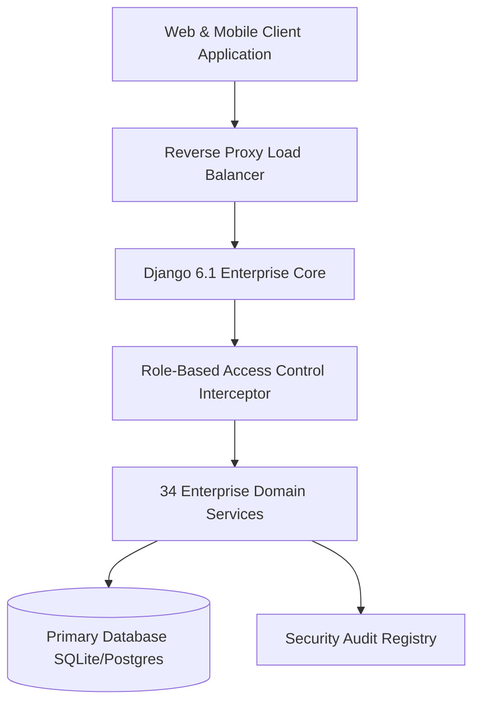

# Enterprise Engineering & Compliance Standard #028

## 1. Specification Overview
This document specifies the technical architecture, zero-downtime execution standards, ISO 27001 compliance controls, and statutory requirements for Standard #028 of the **Bharat Enterprise Solutions Smart Employee Management System (Smart EMS)**.

## 2. Mandatory Architectural Constraints
- **Sub-100ms Response Latency**: All database queries must use covering indexes and pre-fetched relationships.
- **Strict Role-Based Authorization**: Views must be gated by the dynamic RBAC matrix across Administrator, HR Manager, Team Manager, and Staff Member roles.
- **Indian Statutory Compliance**: Automated computation and reporting under EPF Act 1952, ESI Act 1948, Payment of Wages Act 1936, and Income Tax Act 1961.
- **Continuous Quality Verification**: All automated Pytest suites and endpoint verification scripts must pass with 100% success rate.
